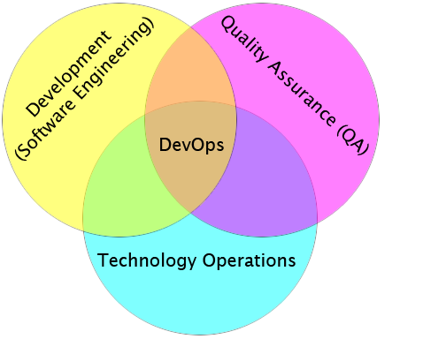
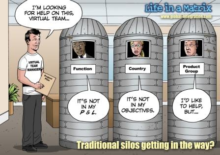
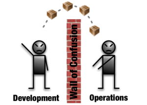
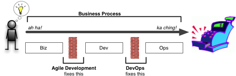

!SLIDE subsection

# DevOps

!SLIDE

# Ce que n&#39;est pas DevOps

!SLIDE

# Un outil

!SLIDE

# Un process

!SLIDE

# Une méthodologie

!SLIDE

# DevOps est avant tout un changement culturel

!SLIDE
# Qui permet de créer un ensemble de processus, méthodes, outils et systêmes pour communiquer, collaborer intégrer le développement, la production et la QA

!SLIDE center

!SLIDE
# L&#39;objectif est de montrer l&#39;interdépendance du développement et de la production pour atteindre un objectif business.

!SLIDE
# Eliminer les silos

!SLIDE center

!SLIDE

# Le mouvement DevOps est une excroissance du mouvement Agile

!SLIDE center

## Le manque de collaboration est flagrant pour le déploiement du nouvelle release

!SLIDE center

## Aligner la société avec un objectif commun

!SLIDE

# L&#39;agilité aide aussi en produisant de petite release en continue

!SLIDE center

!SLIDE bullets

# 3 zones :
* changement de culture
* processus unifiés
* outils internes & unifiés

!SLIDE
## Le développeur est guidé par des besoins fonctionnels
## L&#39;opérationnel est guidé par des besoins *non* fonctionnels

!SLIDE
## Le développeur est la pour ajouter de la valeur (attaque)
## L&#39;opérationnel est la pour ne enlever de la valeur (défense)

!SLIDE
## Le développeur veut du changement
## L&#39;opérationnel veut de la stabilité

!SLIDE bullets
# Développeurs :
* peu intéresser par l&#39;impact du code en production
* ne communiquent pas les changements de configuration
* prennent leur poste de travail comme référenciel

!SLIDE bullets
# Admin :
* ne comprennent peu ou pas le développement
* cachent la production

!SLIDE bullets
# Sujets (dév)
* Contrôle de version
* Build automatisé
* Bugtracker
* Intégration continue / test
* Déploiement automatisé sur plateforme de test

!SLIDE bullets
# Sujets (admin)
* Sécurité
* Backup
* Disponibilité
* Mise à jour
* Configuration management
* Supervision

!SLIDE
# Ce qui permet de...

!SLIDE
# Test automatisé basé sur l&#39;intégration continue

!SLIDE
# Test automatisé de déploiement

!SLIDE
# Test de déploiement en production
## (problématique de migration)

!SLIDE
# Déploiement continue en production

!SLIDE
# Pour résumer

!SLIDE bullets
# Simplicité
* KISS
* répétable
* réutilisable
* facilité pour communiquer

!SLIDE bullets
# Favoriser les relations
* engager tout le monde dans les process
* faciliter la communication (oral > *)

!SLIDE bullets
# Process
* tout automatiser
* tout tester
* déploiement
* monitoring
* redondance

!SLIDE
# Amélioration continue
## (rétrospective, A3, ...)

!SLIDE bullets
# Résultat :
* Meilleur systeme
* plus rapide
* moins cher
* moins risqué
