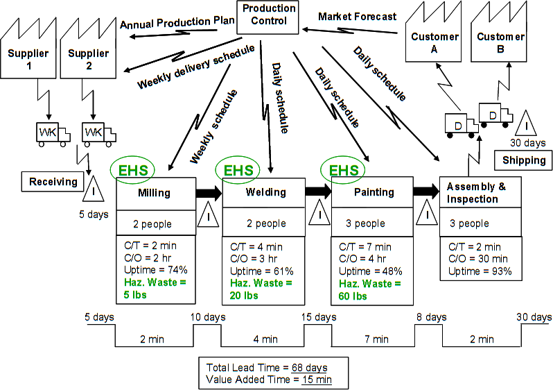

!SLIDE subsection

# Morale de l&#39;histoire ?

!SLIDE

# Des gens motivés

!SLIDE

# Les process semblent efficaces
## (pris individuellement)

!SLIDE

# Alors ?

!SLIDE

# Manque flagrant d&#39;une vision systémique

!SLIDE

# La vision systémique consiste à voir l&#39;ensemble du systême, ainsi que les intéractions</class>.

!SLIDE

# Votre organisation est un éco-systême

!SLIDE

# Le danger est la micro optimisation / micro management

!SLIDE

## (et la, je cite un exemple super pertinent avec une usine)

!SLIDE

# Tout est flux !
## (le développement aussi, cf Kanban)

!SLIDE

# Value Stream Mapping
## (cartographie de la chaine de valeur)

!SLIDE center

