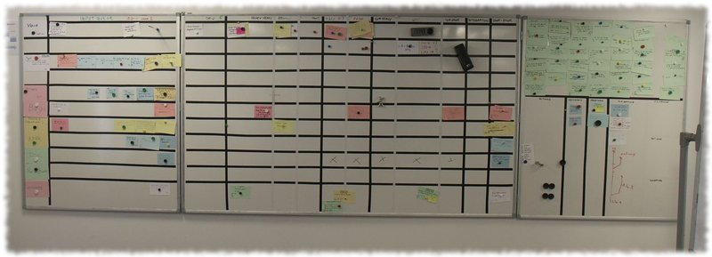

!SLIDE subsection

# Dans mon entreprise

!SLIDE bullets

# Ancienne organisation :
* R&D
* Commerce
* Prod (avant-vente + gestion SI, support, logistique)

!SLIDE

# Des problèmes politiques
## (dans une boite de 30 personnes !)

!SLIDE bullets

# Nouvelle organisation :
* Un flux vente
* Un flux production

!SLIDE

# Une R&D qui intègre tous les profils techniques

!SLIDE

# Un seul manager

!SLIDE

# Un seul openspace

!SLIDE center

!SLIDE

# Déploiement du site Web

!SLIDE

# Pulsar
## (outil admin des clients)

!SLIDE

# Développement d&#39;outils internes pour la prod

!SLIDE

# Labo virtualisée
## Création simplifiée d&#39;une sonde (image)

!SLIDE

# Le systême est versionné
## (kernel, packages, configuration)

!SLIDE

# Déploiement automatisé
## (bout en bout en simulant le workflow client)

!SLIDE

# Déploiement continue

!SLIDE

# Le release management intégre code + systême

!SLIDE

# L&#39;outil de déploiement utilise un outil initialement orienté développement
